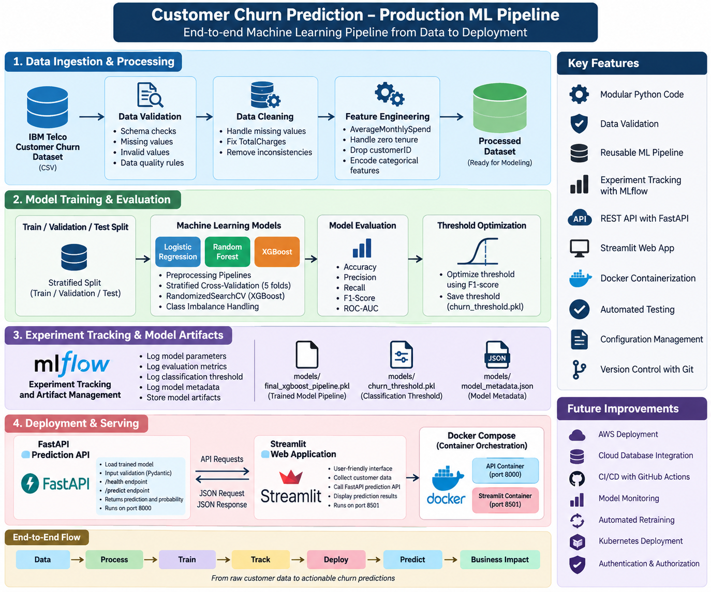

# Customer Churn Prediction – Production ML Pipeline

<p align="center">
  
</p>

<p align="center">

### End-to-End Machine Learning Pipeline with FastAPI, Docker, AWS ECS Fargate, Monitoring & Drift Detection

</p>

**From Customer Data → Machine Learning → API → Docker → AWS → Monitoring**

---

## 1. Project Overview

Customer churn prediction is a binary classification problem where the objective is to identify customers who are likely to discontinue a service.

This project goes beyond a traditional machine learning notebook by implementing a reusable, production-oriented machine learning system covering:

* Data loading
* Data validation
* Data cleaning
* Exploratory Data Analysis
* Statistical analysis
* Feature engineering
* Machine learning model development
* Cross-validation
* Hyperparameter tuning
* Classification threshold evaluation
* MLflow experiment tracking
* Model artifact management
* FastAPI inference API
* Request ID tracing
* Structured application logging
* Prediction monitoring
* Feature drift monitoring
* Automated testing
* Docker
* Docker Compose
* GitHub Actions
* AWS ECR
* AWS ECS Fargate
* AWS IAM
* AWS CloudWatch Logs

> **Project Positioning:** This is a production-oriented portfolio implementation. It demonstrates practical ML engineering and cloud deployment patterns but should not be represented as a fully enterprise production-grade system.

---

## 2. Business Problem

Customer acquisition is often more expensive than retaining existing customers.

A churn prediction system can help businesses:

* Identify customers at high risk of churn
* Prioritize retention campaigns
* Support proactive customer engagement
* Identify churn-related customer characteristics
* Improve customer retention strategies
* Reduce unnecessary retention costs
* Support data-driven customer success decisions

### Model Output

The prediction service produces:

* Churn prediction
* Churn probability
* Prediction label
* Classification threshold used for the prediction

---

## 3. Solution

The project implements a complete machine learning lifecycle:

```text
Customer Data
      ↓
Data Loading
      ↓
Data Validation
      ↓
Data Cleaning
      ↓
Exploratory Data Analysis
      ↓
Statistical Analysis
      ↓
Feature Engineering
      ↓
Train / Validation / Test
      ↓
Model Development
      ↓
Cross Validation
      ↓
Hyperparameter Tuning
      ↓
Model Evaluation
      ↓
Classification Threshold Evaluation
      ↓
Final XGBoost Model
      ↓
MLflow Experiment Tracking
      ↓
Model Artifact
      ↓
FastAPI
      ↓
Automated Testing
      ↓
Docker
      ↓
Amazon ECR
      ↓
Amazon ECS Fargate
      ↓
CloudWatch Logs
      ↓
Prediction Monitoring
      ↓
Feature Drift Detection
```

---

## 4. Complete Architecture

<p align="center">
  
</p>

### End-to-End Architecture

```text
Customer Data
      │
      ▼
Data Loading
(Pandas)
      │
      ▼
Data Validation
(Schema + Quality Checks)
      │
      ▼
Data Cleaning
(Missing Value Handling)
      │
      ▼
EDA & Statistical Analysis
      │
      ▼
Feature Engineering
(AverageMonthlySpend)
      │
      ▼
Train / Validation / Test
      │
      ▼
Model Development
├── Logistic Regression
├── Random Forest
└── XGBoost
      │
      ▼
Cross-Validation
& Hyperparameter Tuning
      │
      ▼
Model Evaluation
      │
      ▼
Final XGBoost Model
      │
      ├──────────────► MLflow
      │                Experiment Tracking
      │                Model Artifacts
      │
      ▼
Saved Model
      │
      ▼
FastAPI Inference API
      │
      ├── /health
      ├── /ready
      ├── /predict
      ├── /monitoring
      └── /drift
      │
      ▼
Docker
      │
      ▼
Amazon ECR
      │
      ▼
Amazon ECS Fargate
      │
      ├──────────────► IAM
      │
      └──────────────► CloudWatch Logs
                              │
                              ▼
                     Monitoring & Observability
                     ├── Prediction Monitoring
                     ├── Latency Monitoring
                     └── Feature Drift Detection
```

---

## 5. Technology Stack

### 5.1 Programming & Data

* Python 3.10
* Pandas
* NumPy
* SciPy
* SQL
* SQLAlchemy
* PyMySQL

### 5.2 Machine Learning

* Scikit-learn
* Logistic Regression
* Random Forest
* XGBoost
* Feature Engineering
* Cross-Validation
* RandomizedSearchCV
* Hyperparameter Optimization
* Class Imbalance Handling
* Classification Threshold Evaluation

### 5.3 Experiment Tracking

* MLflow

### 5.4 API & Application

* FastAPI
* Pydantic
* Uvicorn
* Streamlit

### 5.5 Testing

* Pytest
* FastAPI TestClient
* Dependency Injection
* Test Doubles / Fake Models

### 5.6 Containerization

* Docker
* Docker Compose

### 5.7 Cloud

* Amazon ECR
* Amazon ECS
* AWS Fargate
* AWS IAM
* Amazon CloudWatch Logs

### 5.8 Version Control & CI

* Git
* GitHub
* GitHub Actions

### 5.9 Configuration

* YAML
* Environment Variables

---

## 6. Dataset

The project uses the IBM Telco Customer Churn dataset.

The dataset contains customer-level information including:

* Customer demographics
* Partner and dependent information
* Phone services
* Internet services
* Security services
* Support services
* Streaming services
* Contract information
* Payment method
* Monthly charges
* Total charges
* Customer tenure
* Churn status

### Important Features

```text
gender
SeniorCitizen
Partner
Dependents
tenure
PhoneService
MultipleLines
InternetService
OnlineSecurity
OnlineBackup
DeviceProtection
TechSupport
StreamingTV
StreamingMovies
Contract
PaperlessBilling
PaymentMethod
MonthlyCharges
TotalCharges
Churn
```

The raw dataset is excluded from Git version control through `.gitignore`.

---

## 7. Data Validation & Cleaning

### 7.1 Data Validation

The reusable validation layer checks:

* Required columns
* Empty datasets
* Missing target column when required
* Negative tenure values
* Negative monthly charges
* Negative total charges

Example validation flow:

```text
Input Data
    ↓
Schema Validation
    ↓
Data Quality Validation
    ↓
Validated Dataset
```

### 7.2 Data Cleaning

The original dataset contains blank values in `TotalCharges`.

Investigation showed that the affected customers have:

```text
tenure = 0
```

Therefore, those records are handled using:

```text
TotalCharges = 0
```

This is based on the business interpretation that customers with zero tenure have not accumulated total charges.

The implementation does not use arbitrary mean or median replacement for these specific records.

---

## 8. Exploratory Data Analysis

The project performs exploratory analysis to understand customer behavior and churn patterns.

Areas analyzed include:

* Monthly charges
* Total charges
* Tenure
* Contract type
* Internet service
* Customer demographics
* Customer services
* Churn distribution

---

## 9. Statistical Analysis

Statistical analysis was performed before model development.

### 9.1 Monthly Charges vs Churn

Welch's independent t-test.

### 9.2 Tenure vs Churn

Welch's independent t-test.

### 9.3 Contract vs Churn

Chi-square test and Cramér's V.

### 9.4 Internet Service vs Churn

Chi-square test and Cramér's V.

These analyses help identify relationships between customer characteristics and churn before building predictive models.

---

## 10. Feature Engineering

The project creates a derived feature:

### AverageMonthlySpend

```text
AverageMonthlySpend =
    TotalCharges / tenure
```

For customers with zero tenure:

```text
AverageMonthlySpend = MonthlyCharges
```

The target is encoded as:

```text
No  → 0
Yes → 1
```

The `customerID` column is removed before model prediction because it is an identifier rather than a meaningful predictive feature.

---

## 11. Machine Learning Pipeline

The machine learning workflow includes:

```text
Data Preparation
      ↓
Feature Engineering
      ↓
Train / Validation / Test Split
      ↓
Preprocessing
      ↓
Model Training
      ↓
Stratified Cross Validation
      ↓
Hyperparameter Optimization
      ↓
Model Evaluation
      ↓
Threshold Evaluation
      ↓
Final Model Selection
```

---

## 12. Preprocessing Pipeline

### 12.1 Numerical Features

The numerical preprocessing pipeline uses:

```text
Median Imputation
      ↓
StandardScaler
```

### 12.2 Categorical Features

The categorical preprocessing pipeline uses:

```text
Most-Frequent Imputation
      ↓
OneHotEncoder
      ↓
handle_unknown="ignore"
```

The preprocessing and estimator are combined into a Scikit-learn pipeline to ensure consistent transformations during training and inference.

---

## 13. Class Imbalance Handling

Customer churn datasets commonly contain fewer churned customers than non-churned customers.

The project accounts for class imbalance using model-specific strategies.

Examples include:

```text
class_weight
```

and for XGBoost:

```text
scale_pos_weight
```

This helps the models pay appropriate attention to the churn class.

---

## 14. Models Evaluated

### 14.1 Logistic Regression

Used as a baseline classification model.

Advantages:

* Simple
* Interpretable
* Fast
* Strong baseline for binary classification

### 14.2 Random Forest

Used to capture:

* Nonlinear relationships
* Feature interactions
* Complex decision boundaries

### 14.3 XGBoost

XGBoost was selected as the final model after model comparison and hyperparameter optimization.

The final trained artifact is:

```text
models/final_xgboost_pipeline.pkl
```

---

## 15. Cross Validation & Hyperparameter Optimization

The project uses stratified cross-validation to maintain class proportions across folds.

The XGBoost model is optimized using randomized hyperparameter search.

The process evaluates combinations of model parameters using cross-validation and selects a strong configuration based on ROC-AUC performance.

---

## 16. Final Model Performance

The final XGBoost model achieved:

| Metric                   |     Result |
| ------------------------ | ---------: |
| Cross-Validation ROC-AUC | **0.8492** |
| Test ROC-AUC             | **0.8478** |
| Test Accuracy            | **75.94%** |
| Test Precision           | **53.08%** |
| Test Recall              | **80.75%** |
| Test F1 Score            | **64.05%** |
| Classification Threshold |   **0.50** |

### Interpretation

The model achieves a test ROC-AUC of approximately:

```text
0.848
```

and a test recall of:

```text
80.75%
```

The relatively high recall is useful in a churn-retention scenario where missing potential churners can be costly.

---

## 17. Classification Threshold

The model generates a probability of churn.

The project evaluates classification thresholds rather than blindly relying on the default threshold.

The persisted final threshold is:

```text
0.50
```

The threshold is saved separately:

```text
models/churn_threshold.pkl
```

During inference:

```text
Probability >= Threshold
        ↓
   Churn = 1
```

otherwise:

```text
Probability < Threshold
        ↓
   Churn = 0
```

The API also returns the threshold used for the prediction.

---

## 18. MLflow Experiment Tracking

MLflow is used for local experiment tracking and artifact management.

Tracked information includes:

* Model parameters
* Evaluation metrics
* Classification threshold
* Model metadata
* Tested model artifact

The MLflow workflow provides a structured way to track experiments and model-related artifacts.

### Important Scope

This project implements:

```text
Local MLflow Experiment Tracking
+
Artifact Management
```

It does **not** claim to implement:

```text
Centralized MLflow Model Registry
```

or enterprise model governance.

---

## 19. Model Artifacts

The following model artifacts are generated locally:

```text
models/
├── final_xgboost_pipeline.pkl
├── churn_threshold.pkl
└── model_metadata.json
```

### Model Metadata

The metadata records:

* Model type
* Classification threshold
* Cross-validation ROC-AUC
* Test accuracy
* Test precision
* Test recall
* Test F1
* Test ROC-AUC

Model binary files are intentionally excluded from Git version control.

---

## 20. FastAPI Prediction API

The trained XGBoost pipeline is exposed through FastAPI.

The API provides:

```text
GET  /health
GET  /ready
POST /predict
GET  /monitoring
GET  /drift
```

---

## 21. API Endpoints

### 21.1 Health Endpoint

```text
GET /health
```

Example response:

```json
{
  "status": "healthy",
  "service": "customer-churn-prediction-api"
}
```

This verifies that the application is responding.

### 21.2 Readiness Endpoint

```text
GET /ready
```

The readiness endpoint verifies:

```text
Model Loaded
Threshold Loaded
Prediction Pipeline Available
```

Example:

```json
{
  "status": "ready",
  "service": "customer-churn-prediction-api",
  "model_loaded": true,
  "threshold_loaded": true
}
```

This endpoint is also used by the Docker/ECS health-check configuration.

### 21.3 Prediction Endpoint

```text
POST /predict
```

The API accepts customer information and returns:

```json
{
  "churn_prediction": 1,
  "churn_probability": 0.7654,
  "prediction_label": "Likely to Churn",
  "classification_threshold": 0.5
}
```

---

## 22. API Request Validation

Incoming requests are validated using Pydantic.

Validation includes:

* Non-negative tenure
* Non-negative monthly charges
* Non-negative total charges
* `SeniorCitizen` constrained to valid values
* Probability range validation
* Prediction range validation
* Threshold range validation

Invalid requests are rejected before entering the prediction pipeline.

---

## 23. Request ID Tracing

Each API request receives a unique request ID.

The request ID is:

* Generated at request entry
* Stored in the request state
* Included in application logs
* Returned through the `X-Request-ID` response header
* Included in relevant error responses

Example:

```text
Request started
      ↓
request_id generated
      ↓
Prediction
      ↓
Request completed
      ↓
X-Request-ID returned
```

This provides a basic mechanism for tracing individual requests through the application.

---

## 24. Structured Application Logging

The application uses structured logging for important service events.

Logged events include:

```text
Request started
Request completed
Request failed
Health check requested
Readiness check requested
Prediction request received
Prediction completed
Monitoring metrics requested
Drift monitoring requested
```

Prediction logs include information such as:

```text
request_id
prediction
probability
classification_threshold
prediction_label
latency_ms
```

---

## 25. Lazy Model Loading

The prediction model uses lazy loading.

The model is not loaded immediately when the FastAPI module is imported.

Instead:

```text
FastAPI starts
      ↓
Application available
      ↓
Prediction pipeline requested
      ↓
Model initialized
```

Benefits include:

* Better testability
* Cleaner application startup
* Reduced unnecessary initialization
* Easier dependency injection
* Ability to inject lightweight test models

---

## 26. Prediction Monitoring

The API logs prediction events in JSON Lines format.

Each prediction record contains:

```text
timestamp
request_id
prediction
probability
classification_threshold
prediction_label
latency_ms
```

The monitoring endpoint:

```text
GET /monitoring
```

calculates:

* Total predictions
* Churn predictions
* Stay predictions
* Churn prediction rate
* Average churn probability
* High-risk predictions
* High-risk prediction rate
* Average prediction latency

Example:

```json
{
  "total_predictions": 1,
  "churn_predictions": 1,
  "stay_predictions": 0,
  "churn_prediction_rate": 1.0,
  "average_churn_probability": 0.7654,
  "high_risk_predictions": 1,
  "high_risk_prediction_rate": 1.0,
  "average_latency_ms": 22.6
}
```

---

## 27. Feature Drift Monitoring

The project includes a lightweight feature drift monitoring implementation.

Reference statistics are maintained for:

```text
tenure
MonthlyCharges
TotalCharges
AverageMonthlySpend
```

The monitoring process compares reference statistics against a current production-like dataset.

---

## 28. Drift Calculation

The current implementation measures relative change in feature means:

```text
relative_change =
    |current_mean - reference_mean|
    / |reference_mean|
```

A feature is marked as drifted when:

```text
relative_change >= 0.20
```

The configured threshold is:

```text
20%
```

---

## 29. Simulated Production Batch

A simulated production batch is included to demonstrate drift detection.

The batch intentionally shifts charge-related customer behavior.

The verified monitoring result detected drift in:

```text
MonthlyCharges
TotalCharges
AverageMonthlySpend
```

while:

```text
tenure
```

remained below the configured drift threshold.

Example response:

```json
{
  "overall_drift_detected": true,
  "total_features_checked": 4,
  "drifted_feature_count": 3,
  "drifted_features": [
    "MonthlyCharges",
    "TotalCharges",
    "AverageMonthlySpend"
  ]
}
```

> **Important:** This is a lightweight portfolio implementation of drift monitoring. It is not intended to replace a full statistical monitoring platform.

---

## 30. Streamlit Interface

A Streamlit application provides an interactive frontend for the prediction API.

The workflow is:

```text
User Input
    ↓
Streamlit
    ↓
FastAPI
    ↓
Prediction Pipeline
    ↓
XGBoost
    ↓
Prediction + Probability
    ↓
Streamlit Result
```

The interface displays:

* Churn prediction
* Churn probability
* Prediction label
* Classification threshold

The Streamlit interface is designed for local/containerized demonstration.

The AWS deployment described below focuses on the FastAPI inference service.

---

## 31. Docker Architecture

The project contains separate Docker configurations for the API and Streamlit interface.

```text
Docker Compose
       │
       ├───────────────┐
       ▼               ▼
FastAPI Container   Streamlit Container
Port 8000           Port 8501
       │               │
       └──── HTTP ─────┘
               │
               ▼
        XGBoost Pipeline
```

---

## 32. Docker Containers

### 32.1 FastAPI Docker Container

The API is containerized using:

```text
Dockerfile
```

The container:

* Installs Python dependencies
* Copies API code
* Copies source code
* Copies model artifacts
* Copies configuration
* Starts Uvicorn
* Exposes port `8000`

### 32.2 Streamlit Docker Container

The Streamlit frontend uses:

```text
Dockerfile.streamlit
```

The container exposes:

```text
8501
```

### 32.3 Docker Compose

The complete local application can be started using:

```bash
docker compose up --build
```

API:

```text
http://localhost:8000
```

Swagger:

```text
http://localhost:8000/docs
```

Streamlit:

```text
http://localhost:8501
```

Stop the application:

```bash
docker compose down
```

---

## 33. AWS Deployment

The FastAPI application has been **actually deployed and verified on AWS**.

The deployment architecture uses:

```text
Docker
   ↓
Amazon ECR
   ↓
Amazon ECS
   ↓
AWS Fargate
   ↓
CloudWatch Logs
```

AWS region:

```text
ap-south-1
```

---

## 34. AWS Services Used

| AWS Service     | Purpose                        |
| --------------- | ------------------------------ |
| Amazon ECR      | Container image registry       |
| Amazon ECS      | Container orchestration        |
| AWS Fargate     | Serverless container execution |
| IAM             | ECS task execution permissions |
| CloudWatch Logs | Application/container logging  |

---

## 35. Amazon ECR

The Docker image is stored in an Amazon ECR repository:

```text
customer-churn-production-ml-pipeline
```

The image is pushed to ECR and pulled by the ECS task.

Architecture:

```text
Local Docker Image
      ↓
docker push
      ↓
Amazon ECR
      ↓
ECS pulls image
```

ECR image scanning is enabled for the repository.

---

## 36. Amazon ECS Fargate

The FastAPI application runs as an ECS Fargate task.

Configuration:

```text
Launch Type:
FARGATE

CPU:
512

Memory:
1024 MB

Container Port:
8000
```

The ECS service was successfully verified with:

```text
Desired Count:       1
Running Count:       1
Pending Count:       0
Deployment Status:   COMPLETED
Service Status:      ACTIVE
```

---

## 37. IAM

The ECS task uses an ECS task execution role.

The execution role allows the ECS task to perform required container execution operations such as:

```text
Pull image from ECR
Write container logs to CloudWatch
```

The project does not store AWS credentials in the repository.

---

## 38. CloudWatch Logs

Application/container logs are sent to:

```text
/ecs/customer-churn-api
```

CloudWatch was verified to contain:

* Uvicorn startup logs
* Request logs
* Health-check logs
* Prediction logs
* Monitoring logs
* Drift monitoring logs

Example application event:

```text
Prediction completed
request_id=<request-id>
prediction=1
probability=0.7654
latency_ms=...
label=Likely to Churn
```

---

## 39. AWS Network Architecture

The current demonstration deployment exposes the ECS service through a public IP.

```text
Internet
   │
   ▼
Public IP
   │
   ▼
ECS Fargate Task
   │
   ▼
FastAPI
   │
   ▼
XGBoost Model
```

### Important limitation

The Fargate public IP is **ephemeral**.

If the ECS task is replaced or restarted, the public IP can change.

The current architecture does not yet include:

```text
Application Load Balancer
HTTPS / TLS
Custom Domain
Route 53
```

This is intentionally documented as a learning/demo deployment rather than a fully hardened public production architecture.

---

## 40. AWS API Verification

The deployed FastAPI service was successfully verified.

### 40.1 Health Verification

Endpoint:

```text
GET /health
```

Result:

```text
healthy
```

### 40.2 Readiness Verification

Endpoint:

```text
GET /ready
```

Result:

```text
ready

model_loaded = true
threshold_loaded = true
```

### 40.3 Prediction Verification

Endpoint:

```text
POST /predict
```

Verified response:

```json
{
  "churn_prediction": 1,
  "churn_probability": 0.7654,
  "prediction_label": "Likely to Churn",
  "classification_threshold": 0.5
}
```

### 40.4 Monitoring Verification

Endpoint:

```text
GET /monitoring
```

Successfully returned prediction metrics.

### 40.5 Drift Verification

Endpoint:

```text
GET /drift
```

Successfully detected intentionally shifted production-like features.

---

## 41. Production-Oriented Monitoring Architecture

```text
API Request
     │
     ▼
FastAPI API
     │
     ├───────────────┐
     ▼               ▼
Prediction       Request Log
     │
     ▼
Prediction JSONL
     │
     ▼
/monitoring
     │
     ▼
Operational Metrics
```

Monitoring currently covers:

* Prediction volume
* Churn prediction rate
* Prediction probabilities
* High-risk predictions
* Prediction latency
* Request IDs

---

## 42. Drift Monitoring Architecture

```text
Reference Dataset
       │
       ▼
Reference Statistics
       │
       ├──────────────┐
       ▼              ▼
Reference Mean    Current Mean
                      ▲
                      │
             Production-like Data
                      │
                      ▼
                Drift Calculation
                      │
                      ▼
                 Drift Report
                      │
                      ▼
                   /drift
```

---

## 43. Automated Testing

The project includes automated tests covering:

* API health endpoint
* API readiness endpoint
* API prediction endpoint
* API monitoring endpoint
* API drift endpoint
* Request ID behavior
* Data schema validation
* Data quality validation
* Feature engineering
* Average monthly spending calculation
* Model prediction
* Prediction probability
* Prediction monitoring
* Reference statistics
* Drift calculations
* Drift report generation

---

## 44. Final Test Result

The complete automated test suite currently passes:

```text
26 passed, 2 warnings
```

The warnings are non-failing dependency/deprecation warnings.

The test suite validates the core data, model, monitoring, drift, and API functionality.

---

## 45. CI / GitHub Actions

GitHub Actions is used for automated project validation.

The repository includes workflows for:

```text
.github/workflows/ci.yml
.github/workflows/aws-deploy.yml
```

The CI workflow validates the project through automated testing.

The AWS workflow contains deployment-related build/validation configuration.

> AWS deployment is currently verified through the implemented AWS workflow/configuration and manual deployment process; the project does not claim fully automatic production deployment from every Git push.

---

## 46. Configuration

Project configuration is centralized through:

```text
config.yaml
```

Configuration includes model and monitoring-related paths and settings.

Example categories include:

```text
model paths
threshold paths
monitoring paths
drift threshold
```

Environment-specific secrets are not committed to Git.

---

## 47. SQL Analytics

SQL is included as a supporting analytics layer for customer and churn analysis.

The project contains:

```text
sql/
├── 01_schema.sql
├── 02_data_quality.sql
├── 03_customer_analytics.sql
└── 04_churn_analytics.sql
```

These scripts demonstrate SQL-based:

* Schema creation
* Data quality checks
* Customer analytics
* Churn analytics

> **Important:** The current machine learning inference pipeline uses the processed dataset/model artifacts. The SQL scripts are supplementary analytics components and should not be interpreted as the live AWS inference data source.

---

## 48. Project Structure

```text
Customer-Churn-Production-ML-Pipeline/
│
├── api/
│   ├── main.py
│   └── schemas.py
│
├── app/
│   └── app.py
│
├── aws/
│   ├── README.md
│   ├── deployment-config.yaml
│   └── ecs-task-definition.json
│
├── data/
│   ├── monitoring/
│   ├── processed/
│   └── raw/
│
├── docs/
│   ├── architecture.png
│   └── aws_architecture.md
│
├── notebooks/
│   ├── 01_data_understanding.ipynb
│   ├── 02_data_cleaning_eda.ipynb
│   ├── 03_statistical_analysis.ipynb
│   ├── 04_feature_engineering.ipynb
│   ├── 05_Machine_Learning.ipynb
│   └── 06_mlflow_experiment_tracking.ipynb
│
├── sql/
│   ├── 01_schema.sql
│   ├── 02_data_quality.sql
│   ├── 03_customer_analytics.sql
│   └── 04_churn_analytics.sql
│
├── src/
│   ├── data/
│   │   ├── data_cleaner.py
│   │   ├── data_loader.py
│   │   └── data_validator.py
│   │
│   ├── features/
│   │   └── feature_engineering.py
│   │
│   ├── models/
│   │   └── model_predictor.py
│   │
│   ├── monitoring/
│   │   ├── create_simulated_batch.py
│   │   ├── drift_monitor.py
│   │   ├── prediction_logger.py
│   │   ├── prediction_monitor.py
│   │   └── reference_statistics.py
│   │
│   ├── utils/
│   │   ├── config_loader.py
│   │   ├── logger.py
│   │   └── request_id.py
│   │
│   └── pipeline.py
│
├── tests/
│   ├── test_api.py
│   ├── test_data_validator.py
│   ├── test_doubles.py
│   ├── test_drift_monitor.py
│   ├── test_drift_report.py
│   ├── test_feature_engineering.py
│   ├── test_model_predictor.py
│   ├── test_prediction_monitor.py
│   └── test_reference_statistics.py
│
├── Dockerfile
├── Dockerfile.streamlit
├── docker-compose.yml
├── config.yaml
├── pytest.ini
├── requirements.txt
├── .dockerignore
├── .gitignore
└── README.md
```

---

## 49. Production Engineering Practices

The project demonstrates several practical engineering patterns:

* Modular Python source code
* Separation of data, features, models, API, and monitoring
* Reusable validation functions
* Configuration-driven paths
* Dependency injection for testing
* Lazy model loading
* Request ID tracing
* Structured application logging
* JSONL prediction logging
* Model artifact separation
* API request validation
* Automated testing
* Docker containerization
* Docker Compose
* AWS container deployment
* CloudWatch logging
* Feature drift monitoring
* GitHub version control
* CI automation

---

## 50. Production Limitations

Although the project is production-oriented, several components remain simplified for portfolio and learning purposes.

### Current limitations

* No Application Load Balancer
* No HTTPS/TLS termination
* No custom domain
* No Route 53 configuration
* Direct public ECS task exposure
* Public ECS IP is ephemeral
* Prediction JSONL logs are local to the running container
* Prediction logs are not backed by a persistent production database
* Lightweight mean-based drift detection
* No centralized MLflow Model Registry
* No enterprise model governance
* No automated retraining pipeline
* No enterprise secrets management implementation
* No production-grade distributed monitoring platform

These limitations are intentionally documented rather than hidden.

---

## 51. Future Improvements

Potential future enhancements include:

### Machine Learning

* Deep learning models using PyTorch
* Advanced hyperparameter optimization
* Explainable AI with SHAP
* Automated retraining
* Model performance monitoring with ground-truth labels

### MLOps

* MLflow Model Registry
* Model versioning
* Automated model promotion
* Model rollback
* Feature store integration
* Automated retraining pipelines

### Monitoring

* Statistical drift tests
* Data quality dashboards
* Prediction quality monitoring
* Prometheus
* Grafana
* Centralized log analytics

### AWS

* Application Load Balancer
* HTTPS / TLS
* Route 53
* AWS WAF
* Private subnets
* NAT Gateway
* Secrets Manager
* CloudWatch dashboards
* Auto Scaling

---

## 52. Current Implementation Status

* [x] Data loading
* [x] Data validation
* [x] Data cleaning
* [x] Exploratory Data Analysis
* [x] Statistical analysis
* [x] Feature engineering
* [x] Machine learning
* [x] Cross-validation
* [x] Hyperparameter tuning
* [x] XGBoost final model
* [x] Threshold persistence
* [x] MLflow experiment tracking
* [x] Model artifact management
* [x] FastAPI
* [x] Request validation
* [x] Request ID tracing
* [x] Structured logging
* [x] Prediction monitoring
* [x] Feature drift monitoring
* [x] Simulated production batch
* [x] Automated tests
* [x] Docker
* [x] Docker Compose
* [x] Streamlit interface
* [x] GitHub Actions CI
* [x] Amazon ECR
* [x] Amazon ECS Fargate
* [x] AWS IAM
* [x] Amazon CloudWatch Logs
* [x] AWS API verification

---

## 53. Key Portfolio Takeaways

This project demonstrates practical experience across the complete machine learning lifecycle:

* Python
* SQL
* Pandas
* NumPy
* Scikit-learn
* XGBoost
* Statistical analysis
* Feature engineering
* Model evaluation
* MLflow
* FastAPI
* Pydantic
* Pytest
* Docker
* Docker Compose
* GitHub Actions
* AWS ECR
* AWS ECS Fargate
* AWS IAM
* CloudWatch
* Prediction monitoring
* Feature drift detection

The primary focus is not only model accuracy, but also how a trained model can be structured, tested, served, containerized, deployed, and monitored.

---

## 54. Why This Project Is Different

Many beginner churn projects stop after:

```text
Dataset
   ↓
EDA
   ↓
Model
   ↓
Accuracy
```

This project extends the lifecycle:

```text
Data
 ↓
Validation
 ↓
Cleaning
 ↓
Feature Engineering
 ↓
Model Development
 ↓
Cross Validation
 ↓
Hyperparameter Tuning
 ↓
MLflow
 ↓
Model Artifact
 ↓
FastAPI
 ↓
Testing
 ↓
Docker
 ↓
Amazon ECR
 ↓
ECS Fargate
 ↓
CloudWatch
 ↓
Prediction Monitoring
 ↓
Feature Drift Detection
```

This makes the project more representative of a real-world ML engineering workflow.

---

## 55. Running Locally

### Clone the repository

```bash
git clone https://github.com/sachinsadhish466-arch/Customer-Churn-Production-ML-Pipeline.git
cd Customer-Churn-Production-ML-Pipeline
```

### Create virtual environment

Python 3.10 is recommended.

Windows:

```cmd
py -3.10 -m venv .venv
.venv\Scripts\activate
```

Verify:

```cmd
python --version
```

### Install dependencies

```bash
pip install -r requirements.txt
```

---

## 56. Running FastAPI

Start the API:

```bash
uvicorn api.main:app --reload
```

Open:

```text
http://localhost:8000
```

Swagger documentation:

```text
http://localhost:8000/docs
```

Health endpoint:

```text
http://localhost:8000/health
```

Readiness endpoint:

```text
http://localhost:8000/ready
```

---

## 57. Running Streamlit

Start Streamlit:

```bash
streamlit run app/app.py
```

Open:

```text
http://localhost:8501
```

The Streamlit application communicates with the FastAPI service.

---

## 58. Docker Compose

Build and start both services:

```bash
docker compose up --build
```

API:

```text
http://localhost:8000
```

Swagger:

```text
http://localhost:8000/docs
```

Streamlit:

```text
http://localhost:8501
```

Stop:

```bash
docker compose down
```

---

## 59. Example Prediction Workflow

A prediction request follows:

```text
Customer Input
      ↓
Pydantic Validation
      ↓
DataFrame Creation
      ↓
Data Validation
      ↓
Data Cleaning
      ↓
Feature Engineering
      ↓
Saved XGBoost Pipeline
      ↓
Churn Probability
      ↓
Classification Threshold
      ↓
Prediction
      ↓
Prediction Logging
      ↓
API Response
```

---

## 60. Example Prediction

Example input produces a response similar to:

```json
{
  "churn_prediction": 1,
  "churn_probability": 0.7654,
  "prediction_label": "Likely to Churn",
  "classification_threshold": 0.5
}
```

Interpretation:

```text
Churn Prediction: 1
Probability: 76.54%
Label: Likely to Churn
Threshold: 0.50
```

---

## 61. Security

Security considerations currently implemented include:

* AWS credentials are not stored in the repository
* `.env` files are ignored
* Secrets are excluded from version control
* Model binary artifacts are excluded from Git
* Input validation is implemented with Pydantic
* ECR image scanning is enabled
* ECS uses an IAM task execution role

### Current security limitations

The demonstration deployment exposes the ECS task through a public IP on port `8000`.

For a hardened production deployment, the architecture should use:

```text
Internet
   ↓
Application Load Balancer
   ↓
HTTPS
   ↓
Private ECS Service
```

with appropriate security groups, WAF, secrets management, and network isolation.

---

## 62. Project Verification Summary

The project has been verified across multiple layers.

### Local ML

* XGBoost model trained
* Cross-validation completed
* Hyperparameter tuning completed
* Test evaluation completed
* Threshold persisted
* Model artifact generated

### API

* `/health` verified
* `/ready` verified
* `/predict` verified
* `/monitoring` verified
* `/drift` verified

### Testing

```text
26 passed, 2 warnings
```

### Docker

* FastAPI container verified
* Streamlit container verified
* Docker Compose verified

### AWS

* ECR image pushed successfully
* ECS Fargate service running
* ECS deployment completed
* IAM execution role configured
* CloudWatch logging verified
* Public API verified
* Prediction endpoint verified
* Monitoring endpoint verified
* Drift endpoint verified

---

## 63. Repository

GitHub repository:

**Customer Churn Prediction – Production ML Pipeline**

[https://github.com/sachinsadhish466-arch/Customer-Churn-Production-ML-Pipeline](https://github.com/sachinsadhish466-arch/Customer-Churn-Production-ML-Pipeline)

---

## 64. Author

**Sachin S**

Data Science / Machine Learning Portfolio Project

---

## 65. Project Status

**Status: Completed and Verified**

The project currently includes:

```text
✓ End-to-end ML pipeline
✓ XGBoost model
✓ MLflow experiment tracking
✓ FastAPI inference API
✓ Prediction monitoring
✓ Feature drift monitoring
✓ Automated testing
✓ Docker
✓ Docker Compose
✓ Streamlit interface
✓ GitHub Actions CI
✓ Amazon ECR
✓ Amazon ECS Fargate
✓ AWS IAM
✓ CloudWatch Logs
✓ Verified AWS deployment
```

The implementation is positioned as a **production-oriented machine learning portfolio project**, with known production limitations explicitly documented.

---

## 66. License

This project is intended for educational, portfolio, and demonstration purposes.
